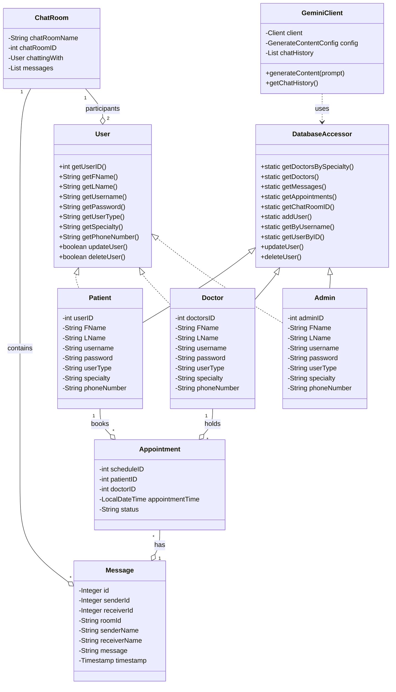

# Online Medical Appointment Application Documentation

## Overview
The Online Medical Appointment Application is a Java-based desktop application designed to streamline the process of booking and managing medical appointments. It supports multiple user roles (Patient, Doctor, Admin) and provides a user-friendly interface for appointment scheduling, user management, and AI-powered assistance.

---

## Features
- **User Authentication:** Secure signup and login for Patients, Doctors, and Admins.
- **Role-Based Dashboards:**
  - **Patient:** View doctors, book appointments, chat with AI, manage profile.
  - **Doctor:** Manage schedule, view appointments, update profile.
  - **Admin:** View statistics, manage users.
- **Appointment Booking:** Patients can search for doctors and book appointments based on availability.
- **Doctor Scheduling:** Doctors can set and manage their available time slots.
- **Chat-Room:** Integrated AI chat assistant (planned integration with Google Gemini).
- **User Profile Management:** Edit personal information and change password.
- **Admin Dashboard:** View application statistics and manage user lists.
- **SQLite Database:** Stores users, appointments, messages, and schedules.

---

## Technologies Used
- **Java 21**
- **Swing/SwingX:** For the graphical user interface
- **SQLite:** File-based database
- **SQLite JDBC Driver:** Database connectivity
- **Maven:** Build and dependency management
- **JUnit 5 & Mockito:** Testing
- **LGoodDatePicker:** Date selection UI
- **Google GenAI SDK:** (Planned) AI chat integration

---

## Installation & Setup
1. **Clone the Repository:**
   ```bash
   git clone <repository_url>
   cd OnlineMedicalAppointment
   ```
2. **Build the Project:**
   ```bash
   mvn clean install
   ```
3. **Run the Application:**
   ```bash
   mvn exec:java
   ```
   Or run the `Main` class from your IDE.

---

## Usage
- **Login/Signup:** Start the application and log in or sign up as a Patient, Doctor, or Admin.
- **Patients:**
  - Search for doctors by name or specialty
  - Book appointments
  - Access chat-room (AI assistant)
  - Manage profile
- **Doctors:**
  - Set and manage available time slots
  - View scheduled appointments
  - Manage profile
- **Admins:**
  - View statistics (appointments, user count)
  - Manage user lists

---

## Project Structure
```
OnlineMedicalAppointment/
├── src/
│   ├── main/
│   │   └── java/
│   │       └── ... (source code)
│   └── test/
│       └── ... (tests)
├── pom.xml
├── online_medical_appointment.db
├── README.md
├── DOCUMENTATION.md
└── ...
```

---

## Database Schema (Overview)
- **users_table:** Stores user credentials and profile info
- **Messages:** Stores chat messages
- **Schedules:** Stores doctor availability and appointments

> The `DatabaseInitializer` class ensures tables are created if they do not exist.

---

## Testing
- **Unit Tests:** Located in `src/test` using JUnit 5
- **Mocking:** Mockito is used for mocking dependencies
- **Run Tests:**
  ```bash
  mvn test
  ```

---

## Future Enhancements
- Full implementation of all dashboard features
- Google Gemini API integration for AI chat
- Improved UI/UX
- Enhanced security (e.g., password hashing)
- Advanced search/filtering
- Appointment reminders and notifications

---

## Contribution Guidelines
1. Fork the repository
2. Create a feature branch
3. Commit your changes
4. Open a pull request

---

## Contact
For questions or support, please open an issue in the repository.

---

## UML Class Diagram

Below is a UML class diagram representing the main classes and their relationships in the system, including private properties (marked with -):

