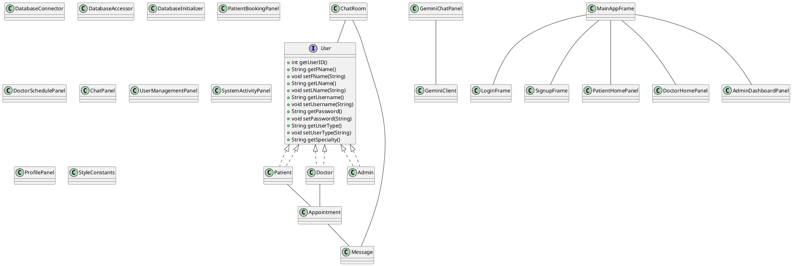

# Project detail.md

## Online Medical Appointment System

This project is a Java Swing-based application for managing online medical appointments. It supports multiple user roles (Patient, Doctor, Admin), appointment booking, chat functionality, AI assistant integration, and administrative dashboards.

---

## Table of Contents
- [Overview](#overview)
- [Key Features](#key-features)
- [Architecture](#architecture)
- [Class Documentation (Javadoc-style)](#class-documentation-javadoc-style)
- [UML Class Diagram](#uml-class-diagram)

---

## Overview
The Online Medical Appointment System allows patients to book appointments with doctors, communicate via chat, and manage their profiles. Doctors can view schedules, chat with patients, and manage appointments. Admins can view statistics, manage users, and monitor system activity.

---

## Key Features
- User authentication and registration (Patient, Doctor, Admin)
- Appointment booking and management
- Real-time chat between patients and doctors
- AI assistant (Gemini) integration for medical queries
- Admin dashboard with statistics and user management
- Accessible and modern UI with scrollable panels

---

## Architecture
- **UI Layer:** Java Swing panels and frames for user interaction
- **Model Layer:** Java classes representing users, appointments, messages, etc.
- **Database Layer:** SQLite database accessed via JDBC
- **AI Integration:** GeminiClient for AI-powered chat

---

## Class Documentation (Javadoc-style)

### com.example.OnlineMedicalAppointment.model

#### User (interface)
Defines common user-related methods for all user types (Patient, Doctor, Admin).

#### Patient
Represents a Patient user. Stores patient-specific information and provides patient-related functionality.

#### Doctor
Represents a Doctor user. Stores doctor-specific information and provides doctor-related functionality.

#### Admin
Represents an Admin user. Provides admin-specific functionality and user information.

#### Appointment
Represents an appointment. Stores details such as patient, doctor, time, and status.

#### Message
Represents a message in the system. Encapsulates sender/receiver info, content, and timestamp.

#### ChatRoom
Represents a chat room between two users. Stores chat room info and users involved.

#### GeminiClient
Client for interacting with the Gemini AI model. Handles generating content based on user queries and chat history.

---

### com.example.OnlineMedicalAppointment.database

#### DatabaseConnector
Utility class for managing database connections (connect, getConnection, close).

#### DatabaseAccessor
Abstract class providing static methods for database access and manipulation (CRUD for users, appointments, messages).

#### DatabaseInitializer
Utility class for initializing the database schema (creates tables if not exist).

---

### com.example.OnlineMedicalAppointment.ui

#### LoginFrame
Frame for user login functionality.

#### SignupFrame
Frame for user signup functionality.

#### MainAppFrame
Main application frame. Adapts content (tabs, menu) based on logged-in user type.

#### PatientHomePanel
Panel for displaying the patient's home view (welcome, quick access, appointments).

#### PatientBookingPanel
Panel for booking appointments as a patient.

#### DoctorHomePanel
Panel for displaying the doctor's home view and appointments.

#### DoctorSchedulePanel
Panel for displaying and managing a doctor's schedule.

#### ChatPanel
Panel for chat functionality (used by both patients and doctors).

#### GeminiChatPanel
Panel for interacting with the Gemini AI Assistant.

#### AdminDashboardPanel
Dashboard panel for admin users (statistics, user/appointment data).

#### UserManagementPanel
Panel for managing users (viewing, deleting).

#### SystemActivityPanel
Panel for displaying system activity statistics.

#### ProfilePanel
Panel for displaying and editing a user's profile information.

#### StyleConstants
Provides consistent styling constants and helper methods for UI components.

---

## UML Class Diagram

---

## Notes
- This documentation is generated as of June 7, 2025.
- For detailed method signatures and additional classes, see the Javadoc in the `src/main/java` directory.
- The UML diagram is provided in PlantUML format for easy visualization.
